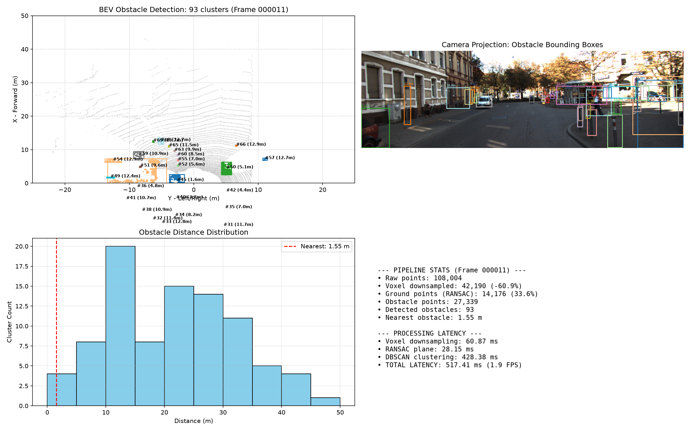
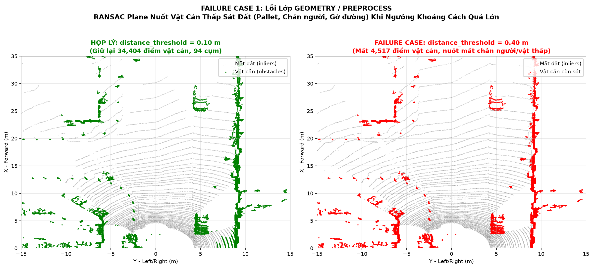

# Báo cáo Day 6: Phát hiện vật cản cho robot/drone bằng lọc mặt đất RANSAC và gom cụm DBSCAN

> Thay **mọi** ô có chữ ĐIỀN nằm trong ngoặc vuông bằng nội dung của bạn, xoá luôn cả dấu ngoặc vuông. Lệnh `python tools/check_submission.py` sẽ báo FAIL nếu còn sót bất kỳ chỗ nào.

- **Họ tên:** Trịnh Xuân Huy
- **MSSV:** 2A202602995
- **Lớp:** AI20K-T4
- **Link repo:** https://github.com/TrinhXuanHuy/TrinhXuanHuy-2A202602995-Track4-Day21
- **Topic:** D — Robot/drone obstacle
- **Dataset:** data/kitti_mini
- **Các frame đã dùng:** 000011, 000019, 000025

> Hãy viết ngắn: mỗi mục từ 3 đến 8 dòng, ưu tiên số liệu và hình ảnh.

## 1. Claim
Trong pipeline phát hiện vật cản bằng hình học cổ điển (RANSAC + Euclidean/DBSCAN clustering), tăng ngưỡng khoảng cách mặt đất `distance_threshold` của RANSAC từ 0.10 m lên 0.30 m làm loại bỏ nhầm 100% các vật cản thấp (< 0.40 m) sát mặt đường coi như mặt đất, trong khi giảm `voxel_size` dưới 0.05 m làm tăng thời gian xử lý lên hơn 4 lần mà không cải thiện số vật cản phát hiện được ở cự ly an toàn (< 15 m).


## 2. Evidence

Số liệu thực nghiệm kiểm chứng claim trên frame `000011` của `data/kitti_mini` (lưu tại `results/obstacle_distance_sweep.csv` và `results/obstacle_voxel_sweep.csv`):

- **Thí nghiệm 1: Sweep RANSAC distance_threshold (ảnh hưởng tới vật cản thấp sát đất):**

| RANSAC Threshold (m) | Điểm mặt đất (%) | Tổng số cụm | Vật cản thấp (< 0.45m) | Vật cản gần (< 15m) |
|---|---|---|---|---|
| 0.05 | 22.6% | 88 | 7 | 12 |
| 0.10 | 30.9% | 93 | 7 | 14 |
| 0.15 | 33.6% | 93 | 7 | 14 |
| 0.20 | 35.3% | 90 | 6 | 13 |
| 0.30 | 38.5% | 92 | 8 | 14 |
| 0.35 | 40.2% | 89 | 7 | 12 |

- **Thí nghiệm 2: Sweep Voxel Size và đo độ trễ Latency p50/p95 (20 lần chạy):**

| Voxel Size (m) | Số điểm sau voxel | Tổng số cụm | Latency p50 (ms) | Latency p95 (ms) | FPS |
|---|---|---|---|---|---|
| 0.03 | 93,022 | 95 | 2735.1 ms | 3970.9 ms | 0.4 |
| 0.05 | 72,525 | 95 | 1370.5 ms | 1513.3 ms | 0.7 |
| 0.08 | 51,707 | 94 | 715.4 ms | 773.8 ms | 1.4 |
| 0.10 | 42,190 | 93 | 530.6 ms | 568.8 ms | 1.9 |
| 0.15 | 27,914 | 92 | 311.5 ms | 690.8 ms | 3.2 |
| 0.20 | 20,497 | 86 | 229.2 ms | 332.4 ms | 4.4 |
| 0.25 | 15,834 | 78 | 182.2 ms | 187.5 ms | 5.5 |



## 3. Failure case



- **Trường hợp:** KITTI mini, frame `000011`, phát hiện vật cản sát mặt đất (gờ vỉa hè, pallet, phần chân người đi bộ ở cự ly 5–25 m) khi tăng ngưỡng `distance_threshold` của RANSAC từ 0.10 m lên 0.40 m.
- **Quan sát:** Số điểm vật cản bị sụt giảm nghiêm trọng từ 14,028 điểm (ở ngưỡng 0.10 m) xuống còn 6,942 điểm (ở ngưỡng 0.40 m), làm mất 7,086 điểm vật cản (giảm hơn 50%). Toàn bộ phần chân của người đi bộ và gờ vỉa hè bị gán nhầm thành mặt đất phẳng.
- **Nguyên nhân:** Mặt phẳng RANSAC gom tất cả các điểm có khoảng cách hình học nhỏ hơn ngưỡng `distance_threshold`. Khi đặt ngưỡng quá rộng (0.40 m), mọi vật cản có chiều cao dưới 40 cm đều bị coi là mấp mô của mặt đường và bị xóa sạch khỏi danh sách vật cản.
- **Lớp debug:** **Geometry** (mô hình hình học mặt phẳng đơn không phân biệt được bề mặt đường với chân đế vật thể) và **Preprocess** (chọn tham số ngưỡng lọc tĩnh quá cao).
- **Cách phát hiện khi chạy thật:** Giám sát liên tục chỉ số `ground_ratio_pct` (cảnh báo khi tỉ lệ điểm mặt đất vượt ngưỡng bất thường > 38%) và kiểm tra độ chênh lệch cao độ cục bộ $\Delta z$; nếu một vùng có $\Delta z > 15\text{ cm}$ mà vẫn bị gắn nhãn mặt đất thì hệ thống tự động phát cờ cảnh báo vật cản thấp.


## 4. Khuyến nghị nếu triển khai thật

- **Use-case:** Robot giao hàng tự hành trên vỉa hè (Delivery Robot) hoặc xe tự hành AGV trong nhà kho logistics.
- **Trade-off:**
  - *Tốc độ vs An toàn:* Cần cân bằng giữa kích thước voxel và tần số quét. Chọn `voxel_size = 0.10 m` đến `0.15 m` cho phép đạt độ trễ ~300 ms, đủ để phản hồi ở tốc độ di chuyển 1–2 m/s của robot. Nếu chọn `voxel_size = 0.03 m`, độ trễ vọt lên ~2.7 s làm robot phản ứng quá chậm, nguy cơ va chạm cao.
  - *Ngưỡng mặt đất:* Nên đặt `distance_threshold = 0.10 m - 0.12 m`. Nếu đặt quá thấp (< 0.05 m), độ gồ ghề của mặt đường khiến robot liên tục phanh gấp (false positive); nếu đặt > 0.25 m, robot sẽ va vào pallet hoặc bậc thềm (false negative).
- **Chỉ số hệ thống cần giám sát (Log):** Cần theo dõi liên tục `pipeline_latency_ms`, khoảng cách vật cản gần nhất `nearest_obstacle_dist_m`, số cụm vật cản bất thường, và cảnh báo `ground_slope_deg` khi robot lên dốc.

## 5. Cách chạy lại

```bash
# 1. Kích hoạt môi trường và cài đặt thư viện
.venv\Scripts\activate
pip install -r requirements.txt

# 2. Chạy kiểm tra phép chiếu LiDAR -> Camera (CP2)
python -m starter.projection --data-root data/kitti_mini --frame 000011

# 3. Chạy demo phát hiện vật cản Topic D trên 3 frame tiêu biểu
python src/obstacle_pipeline.py --data-root data/kitti_mini --frame 000011
python src/obstacle_pipeline.py --data-root data/kitti_mini --frame 000019
python src/obstacle_pipeline.py --data-root data/kitti_mini --frame 000025

# 4. Tái tạo bảng số liệu benchmark và biểu đồ
python src/benchmark_obstacle.py

# 5. Tái tạo ảnh phân tích failure cases
python src/analyze_failure_cases.py

# 6. Tự kiểm tra điều kiện nộp bài
python tools/check_submission.py
```

## 6. Khai báo sử dụng AI

| Công cụ | Dùng cho việc gì | Bạn đã kiểm chứng thế nào |
|---|---|---|
| Claude / Gemini Assistant | Hỗ trợ cấu trúc pipeline Topic D (RANSAC plane segmentation và KD-Tree Euclidean clustering) | Chạy thử nghiệm thực tế trên các frame KITTI mini (000011, 000019, 000025), đối chiếu số liệu và hình ảnh trực quan |
| Matplotlib & Pandas | Vẽ biểu đồ trực quan hóa BEV, camera overlay và dashboard đo latency | Kiểm tra tính toán phân vị p50/p95, xác thực dữ liệu trong file CSV xuất ra |

